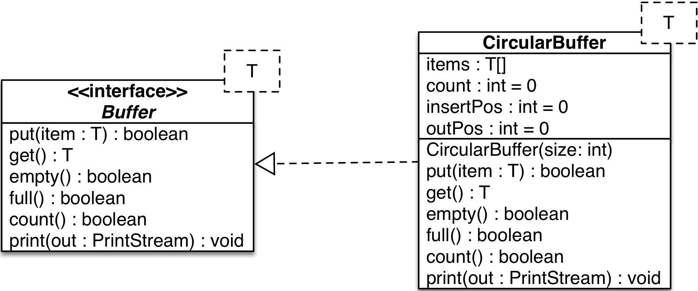
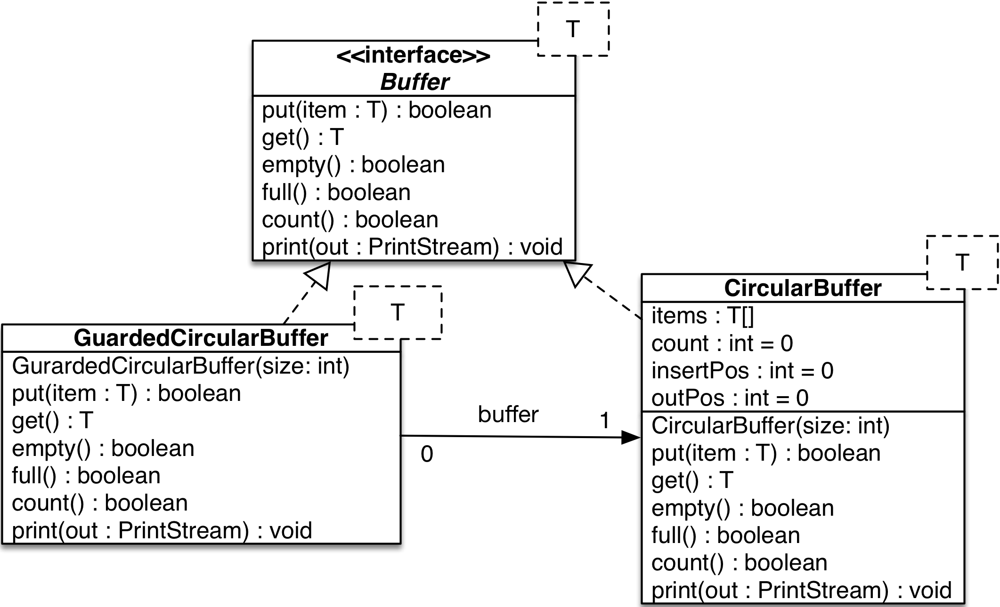
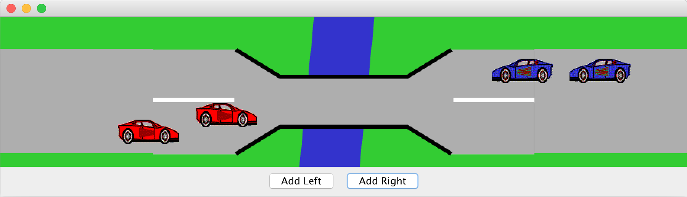
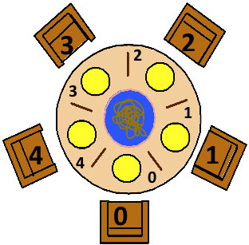
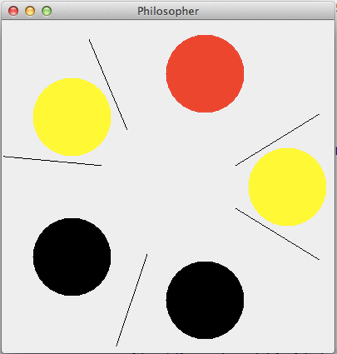

:source-highlighter: coderay
:icons: font
:icon-set: fa
:sectnums:

= Praktikum Concurrency 2

== Producer-Consumer Problem

=== Producer- und Consumer-Thread

Vorgegeben ist eine Implementation eines zirkulären Buffers
(`CircularBuffer.java`, `Buffer.java`) mit folgendem Design:

Als erstes soll ein "Producer" und ein "Consumer" implementiert werden.
Unten ist das Gerüst für beide abgebildet (`CircBufferTest.java`):

[source, Java]
----
class Producer extends Thread {
    public Producer(String name, Buffer buffer, int prodTime) {
        ...
    }
    public void run() {
        ...
    }
}

class Consumer extends Thread
{
    public Consumer(String name, Buffer buffer, int consTime) {
        ...
    }
    public void run() {
        ...
    }
}

----

Der Producer soll Daten in den Buffer einfüllen, und der Consumer soll Daten
herausholen. Auf den Buffer soll nur über das Interface zugegriffen werden.
Das Zeitintervall, in dem ein Producer Daten einfüllen kann, ist mit
`sleep\((int)(Math.random()*prodTime))` zu definieren. Die Zeit fürs konsumieren
können Sie entsprechend mit `sleep\((int)(Math.random() * consTime))` bestimmen.

Für Producer und Consumer wurde bereits ein Testprogramm (`class
CircBufferTest`) geschrieben. Testen Sie damit ihre Consumer- und
Producer-Klassen. Versuchen sie den generierten Output auf der Console richtig
zu interpretieren!
Spielen sie mit den Zeitintervallbereichen von Producer (`maxProdTime`) und
Consumer (`maxConsTime`) und ziehen sie Schlüsse.
Erstellen sie über die Modifikation von `prodCount` und `consCount` mehrere
Producer bzw. Consumer.

[NOTE]
====
Generieren sie in den selber implementierten Klassen keine eigene Ausgabe.
Ändern sie den bestehenden Code nicht. Es stehen zwei Ausgabefunktionen zur
Auswahl: `print()` und `print2()`.
====

=== Thread-Safe Circular Buffer
In der vorangehenden Übung griffen mehrere Threads auf den gleichen Buffer zu.
Die Klasse CircularBuffer ist aber nicht thread-safe. Was wir gemacht haben,
ist daher nicht tragbar. Deshalb soll jetzt eine Wrapper Klasse geschrieben
werden, welche die CircularBuffer-Klasse "thread-safe" macht. Das führt zu
folgendem Design:

Aufrufe von `put` blockieren, solange der Puffer voll ist, d.h., bis also
mindestens ein leeres Puffer-Element vorhanden ist. Analog dazu blockieren
Aufrufe von `get`, solange der Puffer leer ist, d.h, bis also mindestens ein
Element im Puffer vorhanden ist.

[TIP]
====
Verwenden Sie den Java Monitor des `GuardedCircularBuffer`-Objektes!
Wenn die Klasse fertig implementiert ist, soll sie in der `CircBufferTest`
Klasse verwendet werden.
====

Beantworten Sie entweder (a) oder (b) (nicht beide):

[loweralpha]
.	Falls Sie bei der Implementierung der Klasse `GuardedCircularBuffer` die
Methode `notifyAll` benutzt haben: Hätten Sie statt `notifyAll` auch die
Methode `notify` verwenden können oder haben Sie `notifyAll` unbedingt
gebraucht? Begründen Sie Ihre Antwort!

. Falls Sie bei der Implementierung der Klasse `GuardedCircularBuffer` die
Methode `notify` benutzt haben: Begründen Sie, warum Sie `notifyAll` nicht
unbedingt gebraucht haben!

== Single-Lane Bridge

Die Brücke über einen Fluss ist so schmal dass Fahrzeuge nicht kreuzen können.
Sie soll jedoch von beiden Seiten überquert werden können. Es braucht somit eine 
Synchronisation, damit die Fahrzeuge nicht kollidieren.
Um das Problem zu illustrieren wird eine fehlerhaft funktionierende Anwendung, 
in welcher keine Synchronisierung vorgenommen wird, zur Verfügung gestellt. 
Ihre Aufgabe ist es die Synchronisation der Fahrzeuge einzubauen.

Die Anwendung finden Sie im Ordner `handout/Bridge`.
Nach dem Kompilieren (z.B. mit `mvn compile`) können Sie diese starten, in dem 
Sie die Klasse `Main` ausführen (z.B. mit `mvn exec:exec`). Das GUI sollte 
selbsterklärend sein. Mit den zwei Buttons können sie Autos links bzw. rechts 
hinzufügen. Sie werden feststellen, dass die Autos auf der Brücke kollidieren.

.Single-Lane Bridge GUI

Um das Problem zu lösen müssen Sie die den GUI Teil der Anwendung nicht verstehen.
Sie müssen nur wissen, dass Fahrzeuge die von links nach rechts fahren
die Methode `controller.enterLeft()` aufrufen bevor sie auf die Brücke fahren 
(um Erlaubnis fragen) und die Methode `controller.leaveRight()` aufrufen sobald 
sie die Brücke verlassen. Fahrzeuge in die andere Richtung rufen entsprechend 
die Methoden `enterRight()` und `leaveLeft()` auf.
Dabei ist `controller` eine Instanz der Klasse `TrafficController` welche für
die Synchronisation zuständig ist. In der mitgelieferte Klasse sind die vier
Methoden nicht implementiert (Dummy-Methoden).

[loweralpha]
. Bauen sie die Klasse `TrafficController` in einen Monitor um der sicherstellt,
dass die Autos nicht mehr kollidieren. Verwenden Sie dazu den Lock und Conditions
Mechanismus.
[TIP]
Verwenden Sie eine Statusvariable um den Zustand der Brücke zu repräsentieren 
(e.g. `boolean bridgeOccupied`).

. Erweitern Sie die Klasse `TrafficController` so, dass jeweils abwechslungsweise
ein Fahrzeug von links und rechts die Brücke passieren kann. Unter Umständen wird
ein Auto blockiert, wenn auf der anderen Seite keines mehr wartet. Verwenden Sie
für die Lösung mehrere Condition Objekte.

. Bauen Sie die Klasse `TrafficController` um, so dass jeweils alle wartenden
Fahrzeuge aus einer Richtung passieren können und erst wenn keines mehr wartet
die Gegenrichtung fahren kann.
[TIP]
Mit link:{ReentrantLock}[`ReentrentLock.hasWaiters(Condition c)`] können Sie 
abfragen ob Threads auf eine bestimmte Condition warten.

:ReentrantLock: https://docs.oracle.com/javase/8/docs/api/java/util/concurrent/locks/ReentrantLock.html#hasWaiters-java.util.concurrent.locks.Condition-

== The Dining Philosophers (optional)

.**Beschreibung des Philosophen-Problems:**
****
Fünf Philosophen sitzen an einem Tisch mit einer Schüssel, die immer genügend
Spaghetti enthält. Ein Philosoph ist entweder am Denken oder am Essen. Um zu
essen braucht er zwei Gabeln. Es hat aber nur fünf Gabeln. Ein Philosoph kann
zum Essen nur die neben ihm liegenden Gabeln gebrauchen. Aus diesen Gründen muss
ein Philosoph warten und hungern, solange einer seiner Nachbarn am Essen ist.
****
[.float-group]
--
[.left]
.Philosopher Table

[.left]
.Philosopher UI

--

Das zweite Bild zeigt die Ausgabe des Systems, das wir in dieser Aufgabe verwenden.
Die schwarzen Kreise stellen denkende Philosophen dar, die gelben essende und die
roten hungernde. Bitte beachten Sie, dass eine Gabel, die im Besitz eines
Philosophen ist, zu dessen Teller hin verschoben dargestellt ist.

[loweralpha]
. Analysieren Sie die bestehende Lösung (`PhilosopherGui`, `PhilosopherTable`),
die bekanntlich nicht Deadlock-frei ist. Erzeugen Sie ein Projekt in ihrer IDE
und starten Sie anschliessend die Applikation. Nach einiger Zeit geraten die
Philosophen in eine Deadlock-Situation und verhungern. Überlegen Sie sich, wo im
Code der Deadlock entsteht und versuchen Sie, dessen Auftreten schneller
herbeizuführen.

. Passen Sie die bestehende Lösung so an, dass keine Deadlocks mehr möglich sind.
Sie müssen im Wesentlichen den `ForkManager` so anpassen, dass sich Gabelpaare
in einer _atomaren_ Operation belegen bzw. freigegeben lassen.
Die Ausgabe müssen Sie nicht anpassen. Die Änderungen an der Klasse Philosoph
sind minimal, da sie nur den Methodenaufruf für die Freigabe bzw. Belegung der
Gabeln ändern müssen.
[NOTE]
Verwenden Sie für die Synchronisation Locks und Conditions! +
Testen Sie ihre Lösung auf Deadlock-Freiheit!

. (optional) In der Vorlesung haben Sie mehrere Lösungsansätze kennen gelernt.
Implementieren Sie einmal einen alternativen Ansatz, wie zum Beispiel die
Nummerierung der Betriebsmittel.
