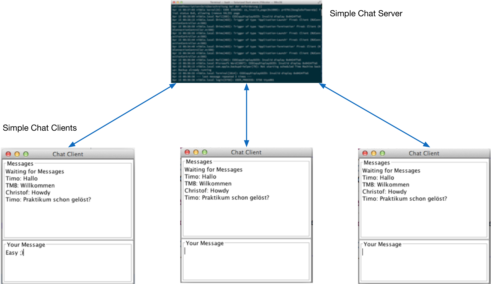

:source-highlighter: coderay
:icons: font
:icon-set: fa
:sectnums:

= PROG2 Praktikum Networking

In diesem Praktikum üben Sie, wie Programme übers Netzwerk kommunizieren können.

Am Ende des Praktikums haben sie

* einen Netzwerkclient programmiert
* einen Netzwerkserver programmiert (Single- & Multi-Threaded)
* ein Anwendungsprotokoll implementiert
* das Java Logging-System angewendet

== Simple Chat

=== Systemsübersicht

In dieser Aufgabe erstellen Sie ein einfaches Chat-System, in welchem mehrere
Benutzer miteinander Nachrichten austauschen können. Jede Nachricht, die ein
Benutzer mittels Chat-Client an den Server schickt, wird unmittelbar an alle
verbundenen Clients verteilt (inkl. dem ursprünglichen Absender)

.Simple Chat Client-Server Scenario

=== Simple Chat Protokoll

Damit die unterschiedlichen Clients und Server zueinander kompatibel sind,
ist das folgende Anwendungsprotokoll vorgegeben.

Als Transportprotokoll wird TCP verwendet.

Nachrichten sind _textbasiert_ und bestehen aus *Header* und *Payload*, welche
durch *`@@`* voneinander getrennt sind (siehe nachfolgende Grafik). Der Header
enthält einen *Typ* (T := 1 Charakter ohne Umlaute -> 1 Byte) und die Länge
(*Length*) des Payload (in Bytes) als String. Der *Payload* besteht aus UTF-8
Text und enthält die eigentliche Nachricht. Je nach Typ wird diese
unterschiedlich interpretiert (siehe Tabelle)

.Protokoll

*Beispiele:*
[horizontal]
Message:: `M5@@Hello`
Command:: `C14@@REGISTER Peter`
Confirm:: `C0@@`
Error::   `E23@@You are not registered!`

Folgende Nachrichtentypen sind vorgesehen:
[cols="^.^1,<.^3,<.^2,<.^6a"]
.Nachrichtentypen
|===
|Typ | Richtung | Bedeutung | Erklärung / Payload

.2+| *C*
| Client -> Server
s| Command
| Kommando an den Server:

* `REGISTER chatname`
* `QUIT`

<| Server -> Client
s| Confirm
| Kommando erfolgreich ausgeführt (kein Payload)

| *E*
| Server -> Client
s| Error
| Fehlermeldung

.2+| *M*
| Client -> Server
.2+s| Message
| Gesendete Nachricht

<| Server -> Client
| Empfangene Nachricht

|===

Um die Implementierung einfach zu halten, können alle Kommandos jederzeit
geschickt werden. Nach dem Kommando (*Command*) muss auf eine Bestätigung
(*Confirm*) oder Fehlermeldung (*Error*) gewartet werden.

Solange der Benutzer seinen Chatnamen nicht registriert hat (*Command REGISTER*),
wird er auf dem Server als _Anonymous-<Nr>_  geführt, wobei die Nummer für
verschiedene Benutzer/Verbindungen unterschiedlich sein muss. Chatnamen, die mit
_Anonymous_ beginnen, sind nicht erlaubt (-> Fehlermeldung).

Mit *Command QUIT* wird die Verbindung beendet. Das *CONFIRM* sollte jedoch noch
abgewartet werden. Nachrichten (*Message*) eines Clients werden vom Server an
alle zurzeit verbundenen Clients verschickt (inkl. Absender). Wie der Client
Benutzereingaben als Kommando und Nachricht unterscheidet, ist Client-spezifisch
und ihnen überlassen.
Beim Verteilen der Nachrichten fügt der Server der Nachricht als Prefix den
Namen des Absenders plus einen Doppelpunkt hinzu (z.B. `Peter Muster: Hallo`
bzw. `Anonymous-<Nr>: Hallo`, falls nicht registriert).

Im Ordner link:../handout/SimpleChat[] stellen wir eine kompilierte Version des SimpleChat
Servers & Clients zur Verfügung. Damit können Sie einerseits die Funktion
ausprobieren und andererseits auch sicherstellen, dass ihr Client resp. Server
kompatibel ist.

Den Server starten sie mittel dem Befehl `java -jar SimpleChatServer.jar 54321`.
Der Client benötigt zusätzlich die IP-Adresse des Servers
`java -jar SimpleChatClient.jar 127.0.0.1 54321`. Optional kann die Portnummer
weggelassen werden. Dann wir der Default-Port `22243` verwendet.

=== Aufgaben

[loweralpha]
. Implementieren Sie den *Chat-Client*. Da die Kommandozeile sich nicht gut
eignet um gleichzeitig Ein- und Ausgaben durchzuführen, stellen wir ein
fertiges, einfaches GUI mit Ein- und Ausgabefeld zur Verfügung (Klassen `Client`
bzw. `ClientView`). Beim Start von des Hauptprogramms `Client` wird automatisch
eine Instanz der Klasse `ClientNetworkHandler` in einem separaten Thread
gestartet. In dieser Klasse implementieren sie die Netzwerk-Kommunikation mit
dem Server. +
Server-Adresse und -Port werden beim Start als Kommandozeilenparameter mitgegeben.
Text im „Your Message“-Feld wird beim Drücken von Enter/Return an die Methode
`sendMessage()` geschickt. Um eine Nachricht im Messages-Textfeld ausgeben,
rufen Sie die Methode `printMessage()` auf. +
[NOTE]
*Testen sie den Client gegen den mitgelieferten SimpleChat-Server*
DasConsole-Log gibt ihnen Feedback ob die gesendeten Pakete erfolgreich verarbeitet
werden konnten. Ein detailierteres Log finden sie zudem in der Datei
`server-x-y.log`. Wobei x (normalerweise 0) bei einem Konflikt erhöht wird
(z.B. wenn ein zweiter Prozess der ins gleiche log schreiben will).
Ab einer bestimmten Grösse wird automatisch eine neue Datei angelegt und y um
Eins erhöht (Logrotate).

. Implementieren Sie einen einfachen *Single-Threaded Chat-Server*, welcher das
obige Simple Chat Protokoll implementiert. Den Server können Sie als normales
Java-Programm in der Konsole/Eclipse starten. Als Startpunkt können Sie z.B.
die `TCPEchoServer` Beispiele aus der Vorlesung verwenden. +
Verwenden Sie für die Ausgabe auf der Konsole ein Java-Logger-Objekt, wie in der
Vorlesung gezeigt. Versehen Sie die ausgegebenen Log-Meldungen mit dem passenden
Log-Level (z.B. Fehler -> `SEVERE` oder `WARNING`, Status -> `INFO`,
Commands -> `FINE`, Meldungen -> `FINEST`)
*	Arbeitet Ihr Client-Programm mit dem Server zusammen?
*	Wie viele Clients können Sie gleichzeitig bedienen?

. Erweitern Sie ihren Server zu einem *Multi-Threaded Chat-Server*, der
_beliebig_ viele Clients bedienen kann. Auch hier können Sie von den
Unterrichtsbeispielen ausgehen.
* Wie organisieren Sie die Kommunikation mit den anderen Threads?
* Müssen Sie den Client auch anpassen?
* Funktioniert Ihr Server auch mit den Clients anderer Studierender?

. Konfigurieren Sie Ihren *Logger* so, dass auf der Konsole nur noch Status und
Fehlermeldungen ausgegeben werden. Kommandos und Meldungen sollten jedoch auch
noch in eine Log-Datei (z.B. ChatLog) ausgegeben werden. +
Fügen Sie dazu einen `java.logging.FileHandler` dem Logger hinzu. Evtl. muss
diesem auch einen geeigneten `java.logging.Formater` zur Seite gestellt werden,
um ein passendes Log-Format zu erhalten. Welchen würden Sie wählen?

. (Optional) Passen Sie Ihren Server so an, dass er nur noch Meldungen an einen
Client weiterleitet, wenn dieser sich registriert hat (*REGISTER*). Ansonsten
wird eine Fehlermeldung zurückgegeben. Das bedeutet, dass verschiedene Zustände
(States) eingeführt werden müssen (z.B. _Unregistered_ & _Registered_), in
welchen der Server unterschiedlich reagiert.
* Welche Nachrichten sind in welchem Zustand noch sinnvoll/erlaubt?
* Wie reagieren Sie wenn für einen Zustand illegale Nachrichten eintreffen?
