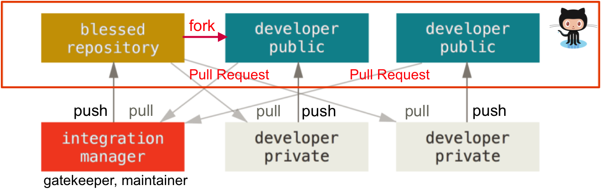

:source-highlighter: coderay
:icons: font
:icon-set: fa
:sectnums:

// references
:lab-handout: link:../handout/git[handout/git]
:gitcheet: http://ndpsoftware.com/git-cheatsheet.html[Git interactive cheetsheet]
:gitref:   https://www.atlassian.com/git/tutorials[Git Reference]
:gitpro:   http://git-scm.com/book/en/v2[Pro Git Book]
:gitright: https://www.atlassian.com/git/tutorials[Getting Git right tutorial]
:gitflow:  http://nvie.com/posts/a-successful-git-branching-model/[Git Flow branching model]
:ghhelp:   https://help.github.com[GitHub Help]
:ghguides: https://guides.github.com[GitHub Guides]
:markdown-guide: https://guides.github.com/features/mastering-markdown/[Markdown on Github]
:zhaw-gh:  https://github.engineering.zhaw.ch/[ZHAW SoE GitHub Enterprise Server]
:install-instructions:  http://git-scm.com/book/en/v2/Getting-Started-Installing-Git[Getting Started Installing Git]
:githubssh: https://help.github.com/articles/adding-a-new-ssh-key-to-your-github-account/[Add SSH key to GitHub]

= PROG2 – Lab Git & GitHub

== Introduction
This lab is designed to help you become familiar with the Git Source Control
system and GitHub collaboration tools that you will be using to manage the
source code of your projects.

=== Objectives
In this excercise you will:

* Setup set up your Git and GitHub environment.
* Learn to master the basic Git workflows.
* Practice cooperation models involving Git and GitHub.

=== Requirements

[horizontal]
**Hardware:**:: none

**Software:** ::
* An up to date web-browser
* Your preferred text editor
* Basic Git installation for your platform (see installation section)

**Resources:** ::
* Files in the Lab project directory {lab-handout}
* User Account on {zhaw-gh}

=== Expected results
Complete the tasks given below. Look up the required commands in the available
documentation (see <<References>>). To complete the assignment you will send a
Pull-Request containing all your commits to the class repository.

=== References
Following some references which my help you to complete the tasks:

* link:{gitcheet}
* link:{gitref}
* link:{gitpro}
* link:{gitright}
* link:{gitflow}
* link:{ghhelp}
* link:{ghguides}
* link:{markdown-guide}
* link:{githubssh}

////
##Preparation Work before the Lab
* none
////

== General Notes
=== Markdown
All the pages in this tutorial will be written in Markdown. Markdown is a simple
and clean markup language, which will be converted to HTML on demand by the
supported online systems (CMS, blogs, ...). GitHub has very good support for
Markdown, therefore it is very often used in GitHub projects.
To get help check the {markdown-guide}.

=== Git Tips
==== Use the command line tools
Try to use the Git command line tools in this lab whenever possible. GUI clients
use often their own abstractions, which may be different from Git.
To learn how it works it is best to use the *native* tools. The git command line
is very expressive and gives a lot of hints.
If you still need some help check the {gitcheet}, lookup the {gitref} or use the
extensive git help pages.

* `git help` lists the basic commands (*porcelain*)
* `git help <command>` shows all the details for the specific command

Sometimes it helps to use a GUI tool to get a better overview. For this you can
also use the simple clients coming with git (`gitk` or `git gui`).

==== Check your git status often
Before you use modifying Git operations (commit, push, pull, ...) always verify
with `git status` that the status of all your files is correct. E.g. before you
commit, check that only the required files for this commit are in the
*staging area*. This is especially important before you push to a remote
repository, because distributed changes are tricky to undo or fix.

==== Stashing
If you started to edit and are not ready to commit, but have to do something
unrelated in your repository, use `git stash save` to temporary store the changes.
As soon you have finished the urgent task, replay the changes back in the current
branch using `git stash pop` (replays latest change). To get a list of all
stashes use `git stash list`.

==== Ask for help
If you are stuck and have a problem you can not solve using the documentation,
ask your peers, the lecturer or lab assistant for help.

== Tasks

This lab consists of three parts:

. <<Setting up Git>>
. <<Master the basic Git workflows>>
. <<Practice Git(Hub) collaboration models>>

=== Setting up Git
==== Installation
Ensure that the command line version of Git is installed on your computer and
that you know how to access it via the command line / terminal interface.

You'll find some basic info for all Systems in the {install-instructions}.

===== Windows

Get the installer from http://git-scm.com/download/win and run it using the
standard options.

If you are are using an older version than Windows 10, are an advanced user and
want to use the command line often, it may make sense to select option 3
"Run Git and Included Unix tools from the Windows Command Prompt" in the PATH
environment dialog. The nice extra is, that you also get a good ssh client which
can be used on the Windows command prompt. No need for putty anymore.

===== Linux

In Linux you can use the standard packet manager of your distribution to install
Git.

* Debian/Ubuntu: `apt-get install git-core`
* Fedora/CentOS/RedHat: `yum install git-core`

===== macOS

You can use the installer from http://git-scm.com/download/mac.

As an alternative you can also install Git using a packet manager for macOS like
Homebrew or MacPorts. Because the packages are usually compiled during
installation you need to install Xcode beforehand. This is recommended
especially, if you already have Xcode installed or you would like to install
also other common unix packages.

* Homebrew (http://brew.sh): `brew install git`
* MacPorts (http://www.macports.org/install.php): `port install git-core`

==== Configuration
===== Basic Git configuration
Before using Git you should configure some basic settings in your user specific
(*--global* ) configuration (will be stored in `~/.gitconfig` or in newer git
versions optionally in `~/.config/git/config`).

Define identity:
[source, bash]
----
git config --global user.name  "Peter Muster"
git config --global user.email "mustepet@students.zhaw.ch"
----

Enable color support:
[source, bash]
----
git config --global color.ui true
----

Set default editor:
[source, bash]
----
git config --global core.editor vi
----

For Windows this might be a little tricky. The following example is setting
Notepad++ as default editor:
[source, bash]
----
git config --global core.editor "'C:/Program Files/Notepad++/notepad++.exe' \
-multiInst -notabbar -nosession -noPlugin"
----

===== Configure your GitHub account
For this lab we are using the GitHub Enterprise server of ZHAW School of
Engineering. It would also work on the public GitHub.

[TIP]
Please do only create public repositories for this lab. It makes the
collaboration workflow much easier, because you do not have to give each user
access rights to your repository.

* Login to the {zhaw-gh}.
* Go to your profile page : "Edit profile".
* Add your Information (at least set the Name).
* Add an Avatar image for your account. A good avatar makes reading the commit
  history much easier.

If you are using ssh to push your changes to your repositories, you must upload
your public ssh key.

* In the Profile page go to the 'SSH keys' menu press 'Add SSH key' and paste
  your public key into the text field.
* On the client side you have to configure the matching private key for this
  configuration. How to do this depends on you client.

Please check the instructions on GitHub about {githubssh}.

[NOTE]
This concludes part 1 of the lab. You should now have a working Git installation.

=== Master the basic Git workflows

Until now you do not have a git repository to work with on your local computer.
There are two options to create Git repositories.

. initializing an empty repository using `git init` (as shown in the lecture).
. cloning an existing repository using `git clone`

In our case we will use option two, to get some prepared content, and because we
will use it in part 3 for collaboration.

.Repositories

In this lab you will be working with four git repositories:

* **upstream**: the original PROG2-lab repository shared with your class +
  `\git@github.engineering.zhaw.ch:**PROG2**/PROG2-lab-__ITxxx__.git`
* **origin**: your personal public fork of the class repository on Github +
  `\git@github.engineering.zhaw.ch:__**mustepet**__/PROG2-lab-__ITxxx__.git`
* **integration**: one of the personal public forks, which is selected within a
  group of students to act as an integration repository in part 3 of this lab
  (see <<Practice Git(Hub) collaboration models>>)
* **local**: local clone in the workdirectory of your personal computer +
  `~/__PROG2_WORKDIR__/PROG2-lab-__ITxxx__`

Please substitute __**mustepet**__ with your ZHAW login, __**ITxxx**__ with your
class name (e.g. IT16aWIN, IT16bWIN oder IT16aZH) and __**PROG2_WORKDIR**__ with
the working directory on your computer.

==== Fork your copy on GitHub

First you __must create your own copy oft this repository__
into your personal GitHub space by **forking** the original copy (**upstream**)
from the @PROG2 organization.

* Make sure you are on the original repository page in the @PROG2 organization.
* In the right upper corner click on 'Fork'.
* If you are a member of multiple organizations you will be asked for the
  organization to fork to. Select your own space @<username> (e.g. @mustepet).
  It is not possible to fork within the same organization.
* As soon the operation finishes, the browser shows your newly copied repository.
* Go to the repository 'Settings' on the right side and ensure, that it is 'public'.

Now your personal public project repository (later called **origin**) is ready.
This will be the repository, where you will publish (push) all your changes.

==== Create your local clone

Next you need to create a local copy (clone) of YOUR public repository,
where you will checkout the working copy and do all the work.

Change to your working directory for PROG2 (__**PROG2_WORKDIR**__) and
create a local clone (**local**) of your personal public fork (**origin**)
Check the documentation (see <<References>>) on how to clone a repository.

[TIP]
Click on 'Clone or download' to get the repository address from the appearing
URL field. Here it is also possible to switch the communication protocol
(SSH or HTTPS).

* Check the contents of the created local repository. Explore also the content
  of the .git directory.
* What is the active (checked out) branch?
* Try to find out, what the meaning of the entries in the configuration file
  (.git/config) is.
* Verify that the clone command by default automatically added a remote named
  **origin** which is pointing to the cloned repository (`git remote`).
  What is the option to show the remote URLs?
  If not, please add the **origin** remote to your repository.

Do not change or edit files yet.

==== Create a feature branch to work on your personal info page

All your edits will be done in a feature branch. To make it unique your should
use your login name as the branch name. In this document we will be using
'mustepet' as a placeholder for your branch name.

* Check the documentation to create a feature branch.
* Make sure, to switch to the new feature branch (e.g. check with `git status`
  or `git checkout`).

==== Create and commit your info page

Next you will create your personal info page in the subdirectory 'participants'
of the example project in {lab-handout}.

* Copy the template page 'participants/template.md' to 'participants/mustepet.md'
* Edit the page to set your name, short name and class.
* Commit your first edit.
** Remember to always check the status, before committing if everything is
   correct.
** use meaningful commit messages "fixed typo" is NOT a good example.
* Add some interests/hobbies to the info page.
* Check the differences between the current and the committed version of the
  file (git diff).
* Add and commit, if everything is ok.
* Check the current history of your repository.
** How many commits are already there?
* If you discover, that you made a mistake in the commit message and you would
  like to update it. This is easy for the last commit, somewhat more difficult
  for earlier commits and very dangerous as soon you already pushed the
  repository.
* Try it and change your last commit message.
* Show the history again and compare it to the one before.
** What do you discover regarding the last commit id? Is it the same as before? Why?
* Now it is time to push your changes upstream.
** Make sure everything is committed.
** Before pushing, check the status on GitHub. What branches exist?
** To push your *new branch* to your default remote (upstream = origin) you need
   to explicitly declare the name of the branch to create
   `git push -u origin mustepet`.
   By default only the current branch is pushed. So verify, that you are on the
   mustepet branch.
** Check the status on GitHub. Do you see the changes?

==== Create and switch branches

Next we want to add your image to the info page. We will do this in a separate
feature branch called 'image'.

* Create a new local feature branch 'image' and switch to it.
* Copy your picture to the `participants/images` directory (name it mustepet.jpg) and add
  it to the repository.
* Add your picture to your info page.
* Commit the changes.

==== Merge Branches

The 'image' feature is done. We need to merge it back to the 'mustepet' branch.

* Switch back to the 'mustepet' branch.
* Check that everything is clean.
* Merge the 'image' branch.
** The merge creates a new commit. The commit message is usually already
   predefined "Merging...".
** You can edit and extend this message.
* Because the merge is done, we do not need the 'image' branch anymore and you
  can delete it.

==== Resolve a conflict
The above merge should have worked flawless. To test conflict resolving, we will
enforce a conflict.

* Create and switch to a new branch called 'conflict'.
* Change your name in your info file.
* Commit the change on the 'conflict' branch.
* Switch to branch 'mustepet'
* Also change your name in the info page, but to a different value.
* Commit your change on the 'mustepet' branch.
* Merge the 'conflict' branch to the 'mustepet' branch. It should give a conflict.
* Check status and edit the file to resolve the conflict manually.
* Mark the conflict as resolved and try to complete the merge.
* After the merge completed successful, you can delete the 'conflict' branch.
* Make sure everything is clean and push the 'mustepet' branch upstream.

==== Inspect history

You already used `git log` to show the history. As soon you did branching and
merging it is not linear anymore. It is possible to show a very nice commit
graph in the console using some options.

Example:
[source, bash]
----
$ git log --oneline --graph --decorate –all
----

or even better:
[source, bash]
----
$ git log --graph --full-history --all --color --pretty=format:'%x1b[33m%h%x09%C(blue)(%ar)%C(reset)%x09%x1b[32m%d%x1b[0m%x20%s%x20%C(dim white)-%x20%an%C(reset)'
----

This is impossible to type each time. So it makes sense to add it as an alias to the configuration:
[source, bash]
----
$ git config --global alias.graphlog "log --graph --full-history --all --color   --pretty=format:'%x1b[33m%h%x09%C(blue)(%ar)%C(reset)%x09%x1b[32m%d%x1b[0m%x20%s%x20%C(dim white)-%x20%an%C(reset)'"
----

Now you can invoke this command using `git graphlog`.

[NOTE]
This concludes part 2 of the lab. You should now master the basic Git workflows.

=== Practice Git(Hub) collaboration models

In part 3 we will practice a typical GitHub collaboration workflow, which is an
'Integration Manager' workflow, adapted to be used with GitHub.
The following picture shows the workflow:

.GitHub Integration Manager Workflow

To do this we will work in groups. If there exists no groups please create
groups of about 2-3 people. Each group member has one of the following two roles:

[horizontal]
Integration Manager (Maintainer)::
  The first user finishing part 2 will take the role of the Maintainer.
Developer (Contributor)::
  All other students will have the developer/contributor role.

If your were following the above instructions, all the repositories required do
already exist. For each developer the public repository on GitHub and the
private on his local computer. Similar for the maintainer, but the role of his
public repository will change to the shared (blessed) repository.

In this part you will jointly develop an overview page for your project in a
shared branch named after a project you choose. In this lab instructions we will
be using '__project-x__' as a placeholder.

**Please substitute '__project-x__' with your chosen project name in all steps below.**

==== Setup the Integration Manager workflow

First distribute the URL for your (maintainers) public blessed repository to all
project members. All project members should add a remote called *integration*
to this repository URL.
Check the documentation on how to add a new remote (Hint: `git remote add ...`.)

**Maintainer**

* Make sure your public repository is in a consistent state.
* Create a new branch '__project-x__' and switch to this branch.
* Copy the template file from 'projects/template.md' to 'projects/__project-x__.md'.
* Update the title, description and add links for backlog and documentation.
* Commit the changes in branch '__project-x__'.
* Push the commit to the public (now blessed) repository.

**Contributors**

* As soon the Maintainer pushed the branch to the public repository the
  Contributors can check out the remote branch '__project-x__' to their local
  machine
  (Hint: `use git checkout -b __project-x__ --track integration/__project-x__`).
* Switch to the new branch '__project-x__'.

==== Create and integrate project file

Next all Project members jointly edit the project overview page.

**Maintainer & Contributors**

* Merge your personal ('mustepet') branch to the '__project-x__' branch.
* Then add a link to your personal info page into the project page below title
  members (use relative links to the mustepet.md page).
* Commit the changes on your local computer.
* Push the changes to your public repository.

**Contributors**

Create a Pull-Request:

* Go to your public GitHub repository.
* Select the branch 'project-x'.
* Create a Pull-Request from '*contributor*/__project-x__' to '*maintainer*/__project-x__'.
* Wait until your request is accepted.
* Continue to periodically pull the updates from the 'integration' repository.
  until the project is complete on all repositories.
* Finally push all updates to your public repository (**origin**).

**Maintainer**

Receive and accept/integrate all Pull-Request:

* Wait for Pull-Requests.
* Verify the content and result of the Pull-Request.
* Accept or Reject the request.
* Repeat until all Requests are OK.
** Also try to do a request manually.
   (See instructions in GitHub, next to the Accept button).

[NOTE]
This concludes part 3 of the lab. You should now a way how to contribute using
the GitHub Integration Workflow.

=== Closing the Lab

==== Send Pull-Request to your branch of the upstream class repository
The upstream class repository 'PROG2-lab-IT...' contains a 'personal branch' for
each student which we call *mustepet* below.

To declare that you finished the lab, send a Pull-Request to 'your personal
branch' (*mustepet*) in the upstream class repository you forked in the
beginning of the lab.
More specific, send a Pull-Request from '*mustepet*/PROG2-lab-ITxxx:**master**'
to 'PROG2/PROG2-lab-IT...:**mustepet**').

==== If you still have time left.

===== Create and push a new repository to GitHub
So far you forked and cloned an existing repository. But how to create a
new initial repository and push it to GitHub?

. Create a local project repository.
* create a new directory in your PROG2 work directory (e.g. 'MyNewProject').
* create some initial project files (e.g. index.md, .gitignore, ...).
* create the local repository (-> `git init`).
* and add/commit them to your new repo (-> `git add`, `git commit`).
. Create an empty project repository on GitHub ('+ > New repository').
* Name your repository (e.g. MyNewProject).
* Add a basic description of your project.
* Do *NOT* select 'Initialize this repository with a README'.
* Do *NOT* add a .gitignore file.
* Press 'Create repository'.
. Push content of your local repo to your GitHub repo and link it upstream.
* Add a remote entry (e.g. *origin*)for your GitHub repository
  (-> `git remote add origin ...`).
* Push the master branch of your local repository to the GitHub project and add
  it as tracking branch (-> `git push -u origin master`).

[NOTE]
**Congratulations! You finished the Lab Git & GitHub**
