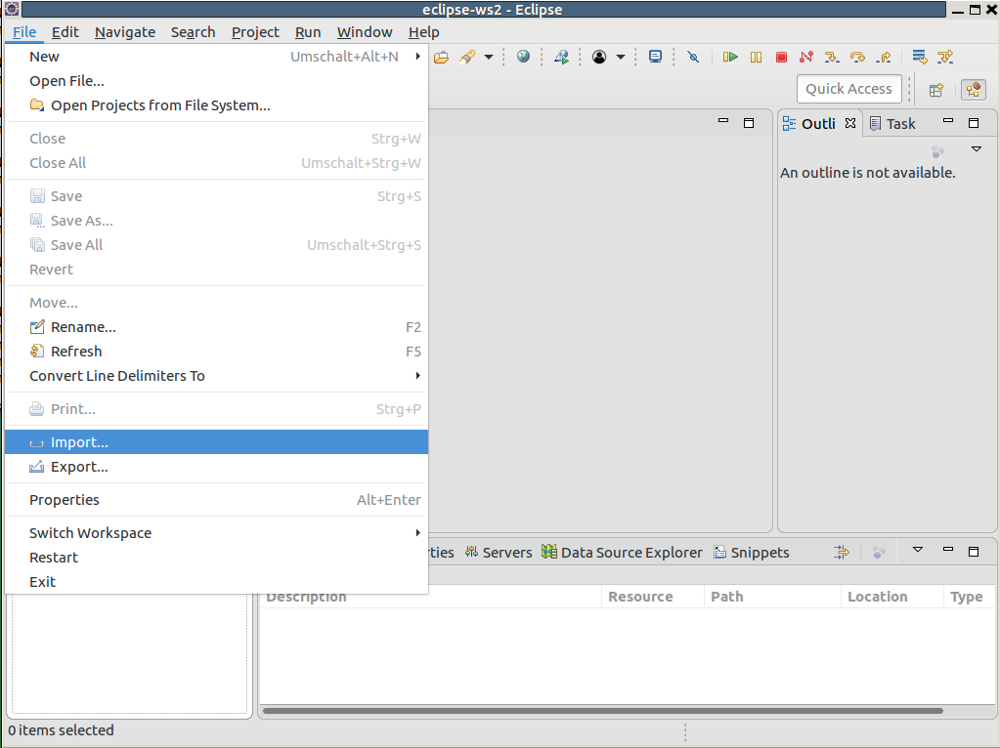

# PSIT1/2 JSP Java Server Page Beispiel employees-app 

Für den zugehörigen **Auftrag** siehe <a href="https://github.engineering.zhaw.ch/PSIT2/psit12-jsp-employee-2017/blob/master/Auftrag.md">Auftrag.md</a>.

Die Zielsetzung dieser Anleitung ist die Möglichkeit aufzuzeigen, wie eine bestehende Java Server Page Anwendung weiterentwickelt werden kann. 

Es besteht aus den Schritte: 

1. Projekt in Git kopieren (fork)
2. Projekt in Eclipse Workspace importieren
3. Projekt mittels Tomcat auf Eclipse laufen und testen

Das <a href="http://www.oracle.com/webfolder/technetwork/tutorials/obe/java/basic_app_embedded_tomcat/basic_app-tomcat-embedded.html">Employees-Tutorial von Oracle </a> wurde auf die Version Tomcat-8 portiert. Ein Anwendungskontext eines Standard-Tomcat-Servers wie http://../employees-app/.. wird unterstützt. 

Ein Video-Tutorial gibt es für Windows unter:
https://www.youtube.com/watch?v=DHGErdq6RTs

## Inhaltsverzeichnis

0. [Voraussetzung](#settings)
1. [Installation Tomcat-Webserver](#installation-tomcat-webserver)
2. [Eclipse - Installation Tomcat-Webserver](#eclipse-installation-tomcat-webserver)
3. [Eclipse - Check for Execution Environments](#eclipse-check-for-execution-environments)
4. [Repository fork in ZHAW github](#repository-fork-in-zhaw-github)

4. [Eclipse - Projekt mit Git Importieren](#eclipse-projekt-mit-git-importieren)
6. [Eclipse - Projekt starten bzw debuggen](#eclipse-projekt-starten-bzw-debuggen)

   

## Voraussetzung

Die Voraussetzung für die Installation der Employees-App, die Sie bereits haben sollten, sind:

* Java: JDK 8.0 <a href="http://www.oracle.com/technetwork/java/javase/downloads/index.html">Download</a>
* Versionsverwaltung: eGit (eclipse git, dies sollte mit eclipse dabei sein) alternativ (nicht offiziell unterstützt von dieser Anleitung) Git <a href="https://git-scm.com/downloads">Download</a>
* Eclipse EE: [Download](https://www.eclipse.org/downloads/eclipse-packages/)

Auf Ihren Computern sollten alle Voraussetzungen erfüllt sein. Sie können diese wie folgt prüfen (windows mittels (windows run): cmd) :

    javac -version
    git --version

Zusätzlich wird ein Tomcat Webserver für die Interpretation und Bereitstellung der JSP-Seiten.

## Installation Tomcat-Webserver
Prüfen Sie zunächst, ob auf Ihrem lokalen Rechner ein Tomcat Server bereits läuft indem Sie folgende URL eintippen:

<a href="http://localhost:8080">http://localhost:8080</a>    

Falls ein Tomcat läuft erscheint folgende Anzeige:

Falls nicht, dann ist der Tomcat nicht gestartet oder nicht installiert.

Falls, Sie das erste mal Tomcat installieren: 
* Webserver: Tomcat 8.5 bzw. 8.0 <a href="http://tomcat.apache.org/download-80.cgi">Download</a>  herunterladen (wichtig mit 9.0 gab es Probleme, deswegen wird 9.0 nicht hier unterstützt)
<a href="http://tomcat.apache.org/tomcat-8.5-doc/">Doku</a>. Eclipse Oxigen unterstützt bereits Tomcat 9.0. Laden Sie am besten die obere .zip falls Sie nicht wissen was ein .tar.gz ist.
Entpacken Sie den Inhalt der zip Datei auf einem geeigneten Ordner (wird später als $TOMCATDIR referenziert, e.g. C:\Users\User\Programme\Tomcat\ , /home/user/src/tomcat/ ,  (für Linux: neuere versionen von eclipse akzeptieren nur auf /home/ zu installieren und nicht mehr auf /opt/ oder /usr/local/) ). 

Damit sollten alle nötige Software-Pakete auf Ihrem Rechner installiert sein.

## Eclipse - Installation Tomcat-Webserver

Tomcat muss auf auf Eclipse eingestellt werden.
Dafür öffnen Sie unter Eclipse->Windows->Preferences den Pereferences Dialog auf. Gehen Sie weiter zu Server->Runtime Environment Menüpunkt.

Fügen Sie eine neue hinzu und wählen Sie Apache Tomcat v8.5.

Setzen in Tomcat installation directory den Pfad $TOMCATDIR wie oben definiert.

Speichern und schliessen Sie den Dialog.

## Eclipse - Check for Execution Environments

Um die Applikation zum Laufen zu bringen, muss auch ein Execution Environment auf Eclipse definiert sein. In Windows -> Preferences -> Java -> Installed JREs Execution Enviroment kann man die JavaSE-1.8 setzen, die für das Projekt benötigt wird. 

Optional kann man eine Installed-JRE setzen und später in dem Projekt-Properties dies entsprechend ändern. 

Ist ein Tomcat und eine JRE gesetzt, kann das Projekt importiert werden. Falls dies nicht geschehen ist, wird das Eclipse - Workspace nicht entsprechend vorbereitet und Folgeproblemen werden die Ausführung des Projekts behindern.

## Repository fork in ZHAW github

Loggen Sie sich mit Ihren ZHAW-Account  in https://github.engineering.zhaw.ch ein.
Forken sie den Repository https://github.engineering.zhaw.ch/PSIT2/psit12-jsp-employee-2017 . Klicken Sie dazu den im Bild  rot umrandedeten Button. 

Das Repository ist dann für Sie unter Ihrem Repository (https://github.engineering.zhaw.ch/$USER/psit12-jsp-employee-2017) verfügbar und veränderbar. 
Ihre Kürzel ist hier wichtig und wird  als $USER referenziert.

## Eclipse - Projekt mit Git Importieren

Um das Projekt in Eclipse zu importieren im aktuellen Workspace *File->Import->* anklicken.

Danach müssen Sie git auswählen. Falls Sie keinen Connector auswählen können, dann muss dieser zuerst installiert werden. Dazu klicken Sie in Eclipse auff Help. Im Eclipse Marketplace können Sie nach dem git bzw. egit Connector suchen. 

Sie können dann zum nächsten Dialog fortfahren.
 

Unter:

können Sie die URL des GitHub Repositories eintragen:

    https://github.engineering.zhaw.ch/$USER/psit12-jsp-employee-2017

Wichtig, ersetzen Sie $USER mit Ihrem Kürzel.
    
Bei 

müssen Sie angeben, wo Sie das git Repository speichern möchten.

Das nächste Dialog erfragt, ob die beinhaltete Projekte in das Working Space importiert werden sollen.

Den nächsten Dialog mit Finish abschliessen.

## Eclipse - Projekt starten bzw debuggen

Jetzt kann die Apllikation gestartet werden.
Wie im Bild, klappen Sie das Projekt auf, Java Resources, src/main/webapp ebenfalls. Mit einem Rechsklick öffnen Sie das Kontext-Menü und unter Run As können Sie die Applikation als Server Applikation laufen lassen.

Jetzt können Sie ebenfalls Debug As (analog über Kontext-Menü). Hier können Sie break points an JSP und an die JAVA Dateien setzen.

 

Die Zugangsdaten sind Username:Admin, password: 123, wie man aus der AdminLogin.java entnehmen kann.

Anleitung basierend auf https://github.engineering.zhaw.ch/bacn/psit12-jsp-employee Webserver mit embedded Tomcat, geändert vom Fernando Benites 2017 und Gerald Perellano 2018.

## P.S. Troubleshooting

### git kann dateien nicht herunterladen
Falls Avira Antivir aktiv ist, bitte ausschalten. Wieder versuchen mit git herunterzuladen, und dann erst wieder einschalten.

### Mit Intellij funktioniert es nicht
Haben Sie bitte Verständnis, dass wir nur eine IDE unterstützen. 

#### Das Projekt findet den Apache Server nicht, obwohl ich es installiert und konfiguriert habe
Wahrscheinlich wurde es umbenannt, das Projekt erwartet eine Konfiguration die den Namen "Apache Tomcat 8.5" hat, wenn es in "Tomcat" umbenannt wurde, findet es nicht und muss man dass umständlich umkonfigurieren. Am einfachsten ist es, noch eine Standard Server Konfiguration hinzuzufügen ("Apache Tomcat 8.5").

#### Es gibt eine .iml, die bei einem Setup funktioniert.
Es ist nicht klar, wie weit man noch anpassen muss.

### Im Film gibt es kein Debug nur run as
Bei dem Schnitt gab es ein Fehler, sollte behoben sein.

### index not found

### index in web-inf

### jre not properly configured before import
