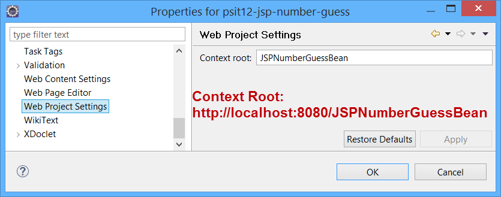

# psit12-jsp-number-guess Beispiel

**Number Guess Beispiel als Dynamic Eclipse Web Project (ohne Maven)**

Für den zugehörigen **Auftrag** siehe <a href="https://github.engineering.zhaw.ch/PSIT2/psit12-jsp-number-guess/blob/master/auftrag.md">auftrag.md</a>.

## Inhaltsverzeichnis

1. [Voraussetzungen](#voraussetzungen)
2. [Eclipse Workspace einstellen](#eclipse-workspace-einstellen)
3. [Eclipse Import Projekt](#eclipse-import-projekt)
4. [Eclipse Projekt Starten](#eclipse-projekt-starten)
5. [Eclipse Context Root einstellen](#eclipse-context-root-einstellen)
6. [Export der war-Datei](#export-der-war-datei)
7. [Starten der Number-Guess-App](#starten-der-number-guess-app)
8. [Installation in Tomcat-Webserver](#installation-in-tomcat-webserver)

 

## Voraussetzungen

Die Voraussetzung für die Installation der NumberGuess-App sind:

* Java: JDK 8.0 <a href="http://www.oracle.com/technetwork/java/javase/downloads/index.html">Download</a>
* Versionsverwaltung: Git <a href="https://git-scm.com/downloads">Download</a>
* Webserver: Tomcat 8.5 bzw. Tomcat 8.0 <a href="http://tomcat.apache.org/download-80.cgi">Download</a>
<a href="http://tomcat.apache.org/tomcat-8.5-doc/">Doku</a>. Eclipse Mars unterstützt nur Tomcat 8.0. Eclipse Neon unterstützt bereits Tomcat 9.0.
  
Eclipse EE: [Download](https://www.eclipse.org/downloads/eclipse-packages/)

 

Die *NumberGuess-App* befindet sich auf dem Github-Server der *ZHAW*. 

    https://github.engineering.zhaw.ch/PSIT2/psit12-jsp-number-guess  

 

##  Eclipse Workspace einstellen

Bitte folgende Einstellungen an Ihrem Eclipse Workspace vornehmen:

**Codierung auf UTF-8 stellen:**

 

**Git konfigurieren:** 

 

**Anzahl Zeichen der Konsole anpassen:** 

 

## Eclipse Import Projekt

Um das Projekt in Eclipse zu importieren im aktuellen Workspace *File->Import* anklicken.

Anschliessend erscheint der untenstehende Dialog:

Sie können die URL des GitHub Repositories eintragen:

    https://github.engineering.zhaw.ch/PSIT2/psit12-jsp-number-guess

     

 

## Eclipse Projekt starten

 

Anschliessend kann unter dem View *Server* der Web-Server gestartet und gestoppt werden.

 

## Eclipse Context Root einstellen

Unter Project->Preferences kann der Context Root eingestellt werden:

 

## Export der war-Datei

Der Export kann mittels File->Export gestartet werden. 

 

 

## Starten der Number-Guess-App

Die Number-Guess-App kann auf folgende Arten gestartet werden:

1. **Standalone mit Webapp-Runner:** 
   <code> java -jar webapp-runner.jar psit12-jsp-number-guess.war</code>   
   Mit Port definierter Nummer 8090:  
    <code>java -jar webapp-runner.jar --port 8090 psit12-jsp-number-guess.war</code>   
ergibt URL: <a href="http://localhost:8090">http://localhost:8090</a>       
3. **Installation in Tomcat-Webserver:**  
   siehe nächstes Kapitel
 

## Installation in Tomcat-Webserver
Prüfen Sie zunächst, ob aauf Ihrem lokalen Rechner ein Tomcat Server bereits läuft indem Sie folgende URL eintippen:

<a href="http://localhost:8080">http://localhost:8080</a>   

Falls ein Tomcat läuft erscheint folgende Anzeige:

Falls nicht, dann ist der Tomcat nicht gestartet oder nicht installiert.

**Linux:** Tomcat steuern mittels Kommandozeile 

    Statusabfrage: service tomcat status
    Start: service tomcat start
    Stop: service tomcat stop
    Restart: service tomcat restart
 

    
**PC:** Tomcat steuern mittels Kommandozeile 

    git bash öffnen
    cd zu Install-Folder-Tomcat/bin
    
    ./startup.sh
    ./shutdown.sh

Die *war-Datei* **psit12-jsp-number-guess.war** aus dem Projekt-Verzeichnis in das webapps-Verzeichnis von Tomcat kopieren. Tomcat installiert die war-Datei automatisch in das Verzeichnis *psit12-jsp-number-guess*

Die Anwendung erhält automatisch einen Anwendungskontext *http://localhost:8080/psit12-jsp-number-guess/* bzw. *http://localhost:8090/psit12-jsp-number-guess/*

Im Browser wird die Number Guess Anwendung angezeigt.

 

**Installation mittels Tomcat-Manager-App:**

Sie können mittels der Manager-App die war-Datei interaktiv dialoggestützt installieren. Damit die Manager-App gestartet werden kann, muss die Datei tomcat-x.x.x\conf\tomcat-users.xml bearbeitet werden. Für das Login wird folgender Eintrag benötigt:

    <role rolename="manager-gui"/>
    <user username="tomcat" password="xxxxxx" roles="manager-gui"/>

Anschliessend Tomcat neu starten und die Manager-App aufrufen. In der Manager-App die war-Datei auswählen und mittels Deploy hochladen.

